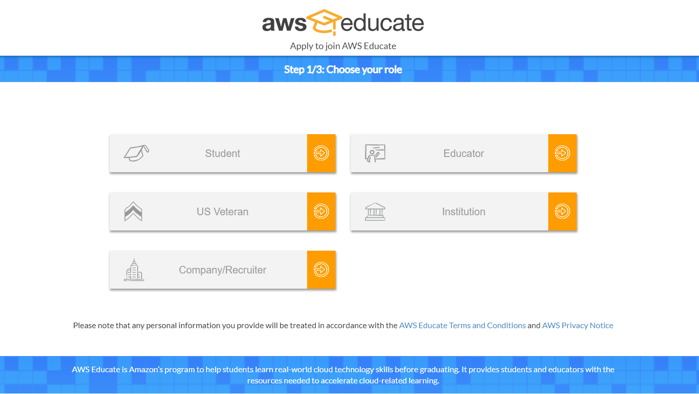
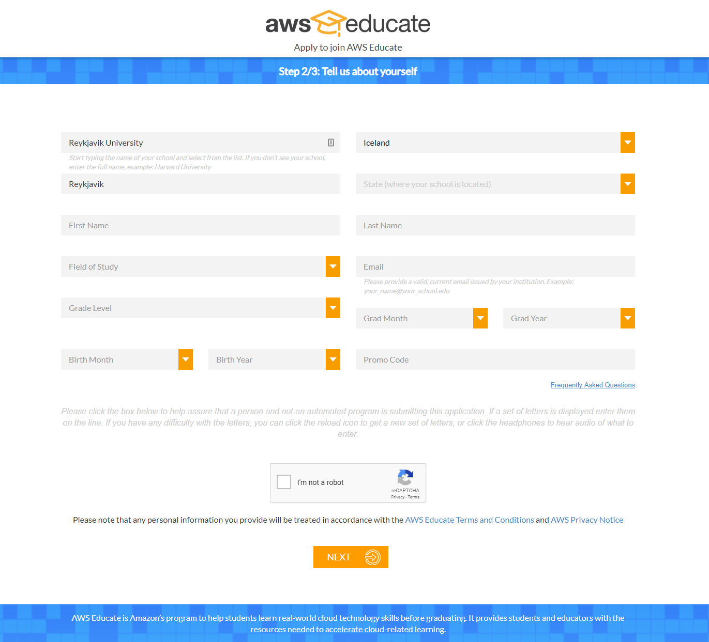
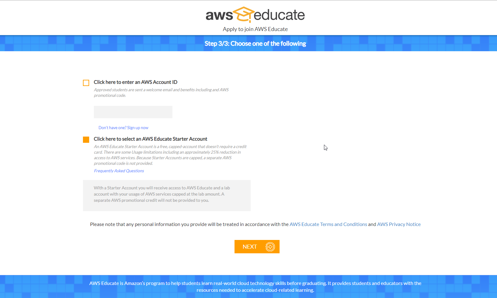
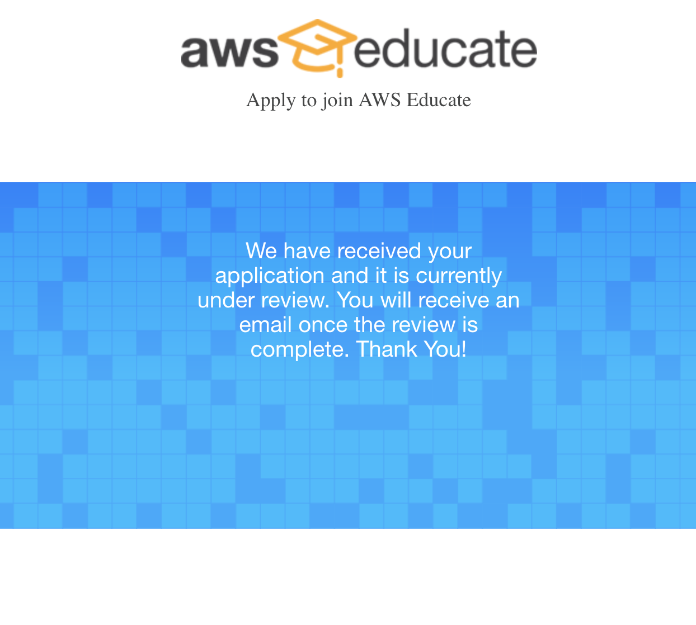
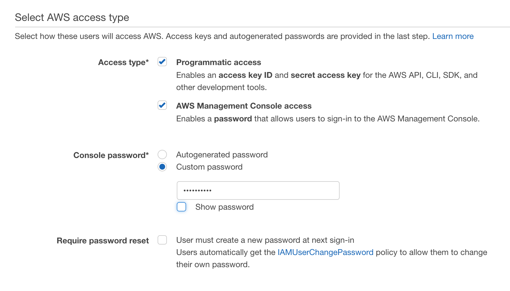
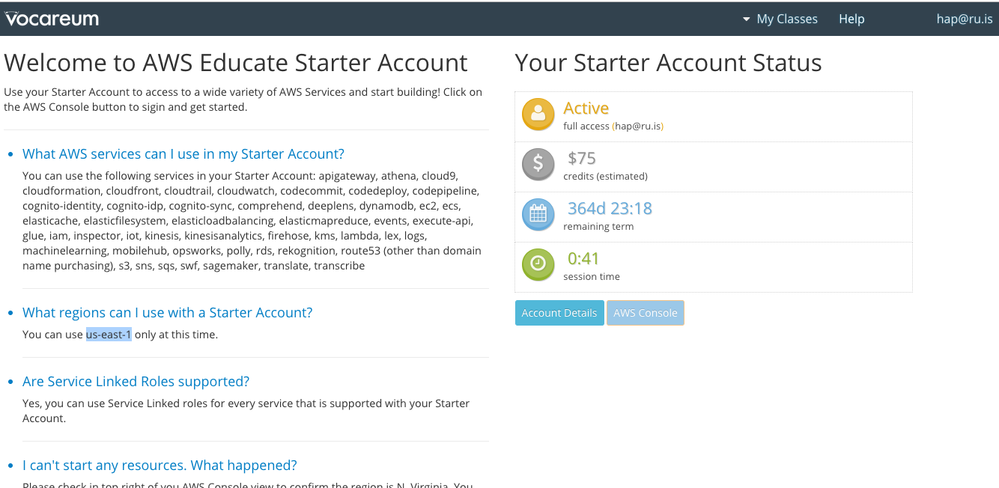

# Day 3 - Provision environment in AWS.

## Objectives

- To be able to run application on an AWS EC2 instance.

## Step 1 - Setting up a student account
Sign up for a student account on [AWS Educate] (https://aws.amazon.com/education/awseducate/)
Step 1: Select Join AWS Educate  
Step 2: Select Student 
Step 3. Fill out the following form 
Step 4. Select "Click here to select an AWS Educate Starter Account" 
Step 4. Wait for confirmation email from AWS, that can take 1-2 days.   
...

Step 5. You should get an email with the subject "AWS Educate Application Approved", follow the instructions in the email and check the following box in the sign up process:   

Step 6. In the final step you should see the following page:
  

## Step 2 - Getting started with Amazon Web Services

### Provision production-like environment spike

Number one: Log carefully all steps you take. We recommend creating a text
document and copying/pasting all commands you make into that document. If you
forget to log a significant command, you can access it later using the "history"
command.

Set up your AWS account.
From the Vocareum page click on the AWS console.

Follow instructions here:

[Get set up for AWS ECS](http://docs.aws.amazon.com/AmazonECS/latest/developerguide/get-set-up-for-amazon-ecs.html)

## Step 3 - Deploy a simple web server
Login to the EC2 instance.
Create a index.html
```
echo "Hello, World" > index.html
```
Run the busybox webserver
```
nohup busybox httpd -f -p 8080 &
```
Check if the server is running (this should output "Hello, World")
```
curl http://<EC2_INSTANCE_PUBLIC_IP>:8080
```

## Step 4 - Terminate instance


### How do I know I'm done?

- [ ] I've created an account on AWS
- [ ] I have one AWS instance running
- [ ] I have a simple webserver running
- [ ] I can visit my AWS site using its public DNS, example
      `http://ec2-SOME-NUMBERS.us-west-2.compute.amazonaws.com/` and see my
      application running
