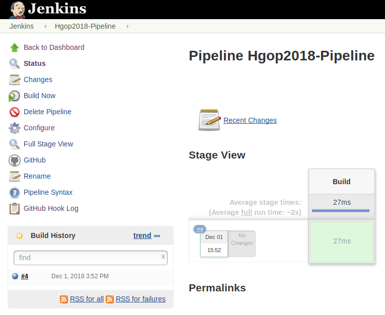

# Jenkins

## Part 1 - Create an EC2 instance

Login to the AWS Console and launch a new Ubuntu Server 18.04 LTS instance.
Select the free-tier option, then use the default settings until you reach
Step 6 - Configure Security Group and use the following firewall rules:

~~~
Type        Protocol        Port Range      Source      Description
SSH         TCP             22              My IP       Used to SSH into the machine.
Custom TCP  TCP             8080            Anywhere    Used to access Jenkins web interface.
~~~ 

This will make your instance accessible from your current IP Address so if you
are at school it won't be accessible from your home IP Address. But you can add
those IP Addresses to your security group from the AWS Console.

Continue with the setup process until you are asked for a key pair. Select the
"Create a new key pair" option. Download the key pair and launch the instance.
You will need the key pair each time you want to connect to the Jenkins machine
through SSH so store it at a secure location and 
<span style="color:red">**Do not push your key pair file to a public git repository!**</span>.

Before you can use your key to ssh into the instance you will have to change the permissions
of the file using command:
~~~
chmod 400 ~/.aws/JenkinsAWSKeyPair.pem
~~~

Your new instance should show up in the AWS Console, select it and copy the Public DNS (IPv4). \
Connect to the machine using:
~~~
ssh -i "~/.aws/JenkinsAWSKeyPair.pem" ubuntu@ec2-34-254-196-196.eu-west-1.compute.amazonaws.com
echo 'You successfully connected to the Jenkins machine as $USER'
exit
~~~

## Part 2 - Setup Jenkins

SSH into your instance.

Upgrade your system.
```bash
sudo apt-get update
sudo apt-get upgrade
```

Install the latest version of Java.
```bash
sudo apt-get install software-properties-common
sudo add-apt-repository ppa:webupd8team/java
sudo apt-get update
sudo apt-get install oracle-java8-installer
sudo apt install oracle-java8-set-default
```

Then follow the [Debian/Ubuntu installation](https://jenkins.io/doc/book/installing/#linux) 
to install jenkins.

Open in browser: `INSTANCE_PUBLIC_DNS:8080` you should see the Jenkins installation page.

Then follow the [Post-installation setup wizard](https://jenkins.io/doc/book/installing/#setup-wizard)
to finish the setup, the only plugins you need to install are:
- GitHub
- Pipeline
- SSH Agent

## Part 3 - Restart the instance

```bash
sudo reboot
```

The ssh connection will close while the system reboots, which is fine, we are
done with it for now.

## Part 4 - Verify

Open in browser: `INSTANCE_PUBLIC_DNS:8080` you should see the Jenkins front page.

### Possible Issues

Your Jenkins instance might not have started, login to the instance again and
start Jenkins:

```bash
sudo service jenkins start
```

Check your security group and make sure port `8080` is open.

## Part 5 - Configure Jenkins

After completing the sign up you should setup Security Credentials

1. Manage Jenkins > Setup Security
2. Check `Enable Security`
3. Check `Logged-in users can do anything`
4. Save

## Part 6 - Create your first pipeline

You will use a `Jenkinsfile` to define your workflow,
[further information on using a Jenkinsfile](https://jenkins.io/doc/book/pipeline/jenkinsfile/).

Create a file called `Jenkinsfile` in your project root.

```
node {
    checkout scm
    stage("Commit") {
        echo "Building..."
    }
}
```

Go to the Jenkins console:

- Go to `create new project`
- Pick `pipeline` project (If it is not available you will need to install the
  plugin)
- Under `configure` go to `Pipeline`
- Set `Definition` as `Pipeline script from SCM`
- As `SCM` choose `Git`
- Add your repository URL (SSH)
- Create new credentials:
  - Kind: `SSH Username with private key`
  - Add your username
  - Set `Private Key Directly`
- Save

## Part 7 - Build

- Push your Jenkinsfile to GitHub
- Build your Jenkins project
- It should look like this:



## Part 8 - The Build Step

You will need to install docker on the Jenkins instance and give the jenkins user
permission to use docker without using sudo.

Now we want Jenkins to build a new docker image for each git commit, to do this
we need two scripts:

`scripts/docker_build.sh`:
```bash
#!/bin/bash

GIT_COMMIT=$1

cd itemrepository
docker build -t username/repo:$GIT_COMMIT .

# TODO exit on error if any command fails
```

`scripts/docker_push.sh`:
```bash
#!/bin/bash

GIT_COMMIT=$1

docker push username/repo:$GIT_COMMIT

# TODO exit on error if any command fails
```

We can access the git commit inside our Jenkinsfile using the `checkout scm`.
Confirm this buy changing your Jenkinsfile:
```Jenkinsfile
node {
    def git = checkout scm
    stage("Build") {
        echo "${git.GIT_COMMIT}"
    }
}
```

Start a Jenkins build and check the build's console output to make sure it writes
out the git commit SHA.
```
# Example SHA-1
3a3e45acb46ab96a4791b8e8c72482958e7abd5a
```

Now that we know how to access the SHA value it's time to use the build and push scripts
in our Jenkins build step.

```Jenkinsfile
node {
    def git = checkout scm
    stage("Build") {
        sh "./scripts/docker_build.sh ${git.GIT_COMMIT}"
        sh "./scripts/docker_push.sh ${git.GIT_COMMIT}"
    }
}
```

Start another build and confirm that an image is pushed to your docker repository with
the correct tag.

Now that our images are being built with a different tag each time, our current
`docker-compose.yml` file won't work anymore since the tag is hard coded.

To work around this we will configure our `docker-compose.yml` to use an environment
variable instead of a hard coded value. In your `docker-compose.yml` file replace 
the image tag with `${GIT_COMMIT}`.

Now you can set an environment variable to run different versions of your image:
```bash
export GIT_COMMIT=3a3e45acb46ab96a4791b8e8c72482958e7abd5a && docker-compose up
```

Now create a script that runs `docker-compose up` using a given git commit as a parameter:
`scripts/docker_compose_up.sh`:
```bash
#!/bin/bash

export GIT_COMMIT=$1
docker-compose down
docker-compose up
```

Try it:
```bash
./scripts/docker_compose_up.sh 3a3e45acb46ab96a4791b8e8c72482958e7abd5a
```

## Part 9 - Trigger a build via WebHook

Now we will add a webhook in your GitHub repository, which is basically configuring
GitHub to call your Jenkins server each time a push is made to your repository to let
it know, so it can start a job.

Go to your GitHub repository:\
Settings > Webhooks\
Add webhook:\
Payload URL: `http://ec2-34-254-196-196.eu-west-1.compute.amazonaws.com:8080/github-webhook/`\
Content Type: `application/x-www-form-urlencoded`\
Secret: ``\
Which events would you like to trigger this webhook?\
`Just push event`\
Active: `enabled`

Now a message will be sent to your Jenkins server each time you push your commits to
the repository, now configure your Jenkins project to trigger a build for each commit
by:

Going to Jenkins > Project > Configure\
In Build Triggers:\
GitHub hook trigger for GITScm polling: `enabled`

Now push some changes to your repository and verify that a build was automatically
triggered for your Jenkins project.

## How do I know I'm done?

- [ ] Each time I commit code to my repository, a build job is started automatically
      in my Jenkins project that builds and publishes a new image with the git commit's
      SHA has as a tag.

## Handin

You should store all the source files in your repository:

```bash
├── itemrepository
│   ├── app.js
│   ├── database.js
│   ├── Dockerfile
│   └── package.json
├── assignments
│   ├── day01
│   │   └── answers.md
│   └── day02
│       └── answers.md
├── scripts
│   ├── initialize_game_api_instance.sh
│   ├── verify_environment.sh
│   ├── docker_compose_up.sh
│   ├── docker_build.sh
│   ├── docker_push.sh
│   └── deploy.sh
├── docker-compose.yml
├── infrastructure.tf
├── Jenkinsfile
└── README.md
```

They must be placed at these location to get full marks.
