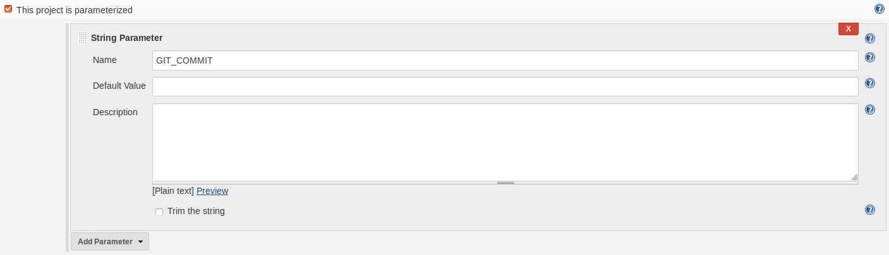

# The Pipeline

Today we are going to continue working on the Jenkins pipeline we setup in day 6.\
After today the game should deploy automatically when we commit to GitHub given
that each stage finishes successfully.\
Stages:
- Commit (Jenkins Job)
  - Clean (Jenkinsfile Stage)
  - Setup (Jenkinsfile Stage)
  - Lint (Jenkinsfile Stage)
  - Test (Jenkinsfile Stage)
  - Build (Jenkinsfile Stage)
  - Trigger Deploy Job
- Deploy (Jenkins Job)

**Note**: In the Jenkinsfile, a stage is different than how it is referred to in the
course. In the course we talk about a `Commit` stage, this is different in the
Jenkinsfile where a stage just defines a scope within the Jenkins pipeline. 

## Part 1 - Jenkins

While it's preferable to install project dependencies for each build some dependencies
require root permission or are too slow to be installed every build. So you should 
install them beforehand via SSH make sure:

- aws-cli
- Docker
- docker-compose
- git
- NodeJS
- terraform
- yarn

are installed and make sure the Jenkins user has access to them all without requiring
`sudo` permission.

## Part 2 - Clean

We want each run of the pipeline to run independently of each other, so we have to
remove all the files that were generated in the previous run.\
Jenkins will already have cloned and checked-out the commit that triggered the build
(GitHub Plugin), so we would like to keep the files that are in our repository but
remove everything else from our workspace.\
To wipe out all the files that have not been `git add`ed to our repository:
```bash
echo 'I solemnly swear that I know not to run this without committing changes I want to keep!'
git clean -dfxq
```

And to remove all changes that might have been made to the files that git is tracking:
```bash
git stash
```

Create a `Clean` step in your Jenkinsfile and add these two commands to it.

## Part 3 - Setup

In this step we want to install our project dependencies, in our case we only
have to install our `npm packages`.

## Part 4 - Lint

Here we want to check our code quality using a [ESLint](https://eslint.org/).\
Use `npm` to install the [JSLint](https://www.npmjs.com/package/eslint) package as a **dev** dependency.\
You can run ESLint by calling:
```bash
node ./node_modules/eslint/bin/eslint.js
```

Configure ESLint:
```bash
$ node ./node_modules/eslint/bin/eslint.js --init
  ? How would you like to configure ESLint? Use a popular style guide
  ? Which style guide do you want to follow? Google (https://github.com/google/eslint-config-google)
  ? What format do you want your config file to be in? JSON
  ...
  ? Would you like to install them now with npm? Yes
```

It should create a `.eslintrc.json`, add es6 to the configuration:
```json
{
    "extends": "google",
    "env": {
        "es6": true
    }
}
```
You can modify the settings however you want, but the should enforce a consistent coding standard.

Then create a script inside your `package.json` that runs ESLint on all your javascript files.
```bash
npm run eslint
```

Your Jenkins lint stage should use this new command.

Commit your code and you should see Jenkins fail the Lint stage if you have any lints.

Now fix the remaining lints (if any) and make sure it passes in the Jenkins pipeline.

Make sure Jenkins fails at least once in the lint stage to make sure it's working,
by introducing a lint yourself if needed.

## Part 5 - Test

This step is where we run our unit tests, use the npm script you created in day 7.

## Part 6 - Deploy

### AWS Educate Session Work Around

Normally we would create a role for our Jenkins instance that would have permissions to
everything Terraform needed to create and destroy the infrastructure.\
But AWS Educate does not allow us to create roles or users so we are stuck with using
the session key like we did in day 3 and 4. The session key only works for an hour, so
we will need to update it before each deployment (This would not be necessary if we
were using a non-educational account).

Here is a script you can use to update the credentials on the Jenkins instance:\
`scripts/sync_session.sh`
```bash
#!/bin/bash

JENKINS_URL=# YOUR JENKINS URL

scp -o StrictHostKeyChecking=no -i "~/.aws/JenkinsAWSKeyPair.pem" ~/.aws/credentials ubuntu@${JENKINS_URL}:~/credentials
ssh -o StrictHostKeyChecking=no -i "~/.aws/JenkinsAWSKeyPair.pem" ubuntu@${JENKINS_URL} "sudo mv ~/credentials /var/lib/jenkins/.aws/credentials"
ssh -o StrictHostKeyChecking=no -i "~/.aws/JenkinsAWSKeyPair.pem" ubuntu@${JENKINS_URL} "sudo chmod a+r /var/lib/jenkins/.aws/credentials"
```
It will copy the local aws credentials from your local machine to the Jenkins instance.\
Move it to Jenkins's aws configuration directory.\
Give all users permission to read the credentials file.

### Deployment

Now you can terminate all your **game** instances on AWS since Jenkins will be the one using Terraform
to manage our AWS resources from now on.

Since we do not using any of the commercial solutions that take care of storing and syncing
Terraform's state between machines. We will work around that by only using Terraform from
inside a folder in our Jenkins user's home directory `/var/lib/jenkins/terraform/hgop/production`.\
So in the deployment stage we want to remove all `.tf` files from the terraform directory
and then copy all `.tf` files from our workspace/repository into that folder.\
This means the state information Terraform uses to track the infrastructure it's managing
is stored inside `/var/lib/jenkins/terraform/hgop/production`.

You will need to install both Terraform, the AWS client and copy the key to the Jenkins instance.

Create a new free style Jenkins job for the deployment stage, it should contain an `execute shell`
build step:
```bash
rm -rf repository
git clone git@github.com:username/repo.git repository
cd repository
git checkout $GIT_COMMIT

# Delete all .tf files from /var/lib/jenkins/terraform/hgop/production
# Copy all .tf files from repository to /var/lib/jenkins/terraform/hgop/production

cd /var/lib/jenkins/terraform/hgop/production
terraform init # In case terraform is not initialized.
terraform destroy -auto-approve
terraform apply -auto-approve

echo "Game API running at " + $(terraform output public_ip)

ssh -o StrictHostKeyChecking=no -i "~/.aws/GameKeyPair.pem" ubuntu@$(terraform output public_ip) "./initialize_game_api_instance.sh"
ssh -o StrictHostKeyChecking=no -i "~/.aws/GameKeyPair.pem" ubuntu@$(terraform output public_ip) "./docker_compose_up.sh $GIT_COMMIT"

#TODO exit on error if deployment fails.

exit 0
```
The initialization script should no longer start the API.

Now to trigger the `deployment` stage from the `commit` stage we can use the build command and
sending in the git commit SHA as a parameter.\
Add the following to your Jenkinsfile:
```Jenkinsfile
node {
    def git = checkout scm
    ...
    stage("Test") {
        ...
    }
    build job: 'name of deployment job', parameters: [[$class: 'StringParameterValue', name: 'GIT_COMMIT', value: "${git.GIT_COMMIT}"]]
}
```

You will need to configure the deployment job to receive the parameter:


## Handin

You should store all the source files in your repository:

```bash
├── game-api
│   ├── .eslintrc.json
│   ├── app.js
│   ├── deck.js
│   ├── dealer.js
│   ├── lucky21.js
│   ├── lucky21.unit-test.js
│   ├── database.js
│   ├── Dockerfile
│   └── package.json
├── assignments
│   ├── day01
│   │   └── answers.md
│   └── day02
│       └── answers.md
├── scripts
│   ├── initialize_game_api_instance.sh
│   ├── verify_environment.sh
│   ├── docker_compose_up.sh
│   ├── docker_build.sh
│   ├── docker_push.sh
│   ├── sync_session.sh
│   └── deploy.sh
├── docker-compose.yml
├── infrastructure.tf
├── Jenkinsfile
└── README.md
```

They must be placed at these location to get full marks.
